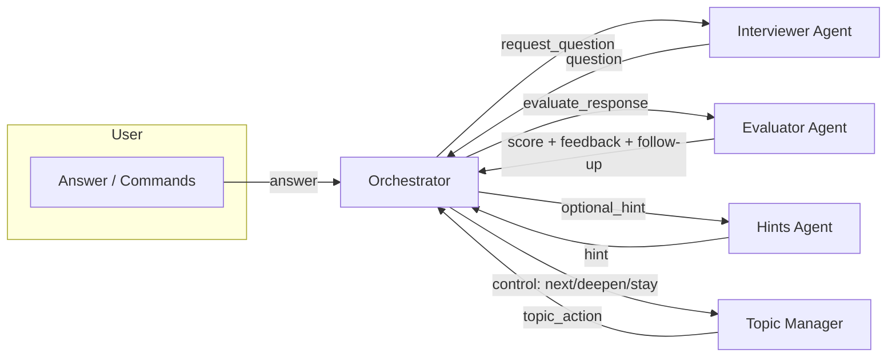

# Mock Interview Multi‑Agent System

Modern, async Python system that simulates a realistic mock interview with multiple collaborating agents. It parses a resume and job description, plans topics, asks questions, evaluates answers, provides hints, and adapts the interview path.

## Features
- Orchestrated multi‑agent pipeline: interviewer, evaluator, hints, topic manager, coordinator
- Topic planning with adaptive depth and next/skip controls
- Async agent communication using simple message passing
- CLI and Web UI (FastAPI + static frontend)
- Pluggable LLM provider via env (OpenAI or Anthropic) with basic retries/timeouts
- Exportable transcript and lightweight telemetry

## Architecture
Agents communicate via plain messages with clear roles, prioritizing reliability over heavy frameworks.



Key modules:
- `agents/orchestrator_agent.py`: coordinates the round flow and timing counters
- `agents/interviewer_agent.py`: crafts questions by topic/depth
- `agents/evaluator_agent.py`: scores answers and returns strengths/improvements
- `agents/hints_agent.py`: provides succinct hints when available
- `agents/topic_manager_agent.py`: manages topic progression and depth
- `tools/llm_client.py`: async LLM wrapper with provider detection and retries
- `server.py`: FastAPI endpoints and static SPA
- `main.py`: CLI runner

## Quickstart
Requirements: Python 3.10+

1) Install dependencies
```bash
pip install -r requirements.txt
```

2) (Optional) Dev tools
```bash
pip install -r requirements-dev.txt
pre-commit install
```

3) Configure environment
Copy `.env.example` to `.env` and update keys. Minimal variables:
```
OPENAI_API_KEY=...
ANTHROPIC_API_KEY=...
MODEL_PREFERENCE=openai:gpt-4o-mini
LOG_LEVEL=INFO
```

### Run CLI
```bash
python main.py
```

### Run Web UI
```bash
python server.py
# then open http://127.0.0.1:8000
```

On Windows, you can also use:
```powershell
./run_web.ps1
```

## Configuration
See `utils/config.py`. Supported variables:
- `OPENAI_API_KEY` (or `OPENAI_KEY` or `OPEN_API_KEY`)
- `ANTHROPIC_API_KEY`
- `MODEL_PREFERENCE` (e.g., `openai:gpt-4o-mini`, `anthropic:claude-3-5-sonnet-20240620`)
- `REQUEST_TIMEOUT_SECONDS` (default 30)
- `MAX_RETRIES` (default 3)
- `LOG_LEVEL` (default INFO)

## Development
- Code style: Black + Ruff via pre-commit
- Keep agent roles small, message contracts clear, and prefer async/await
- Add basic error handling and maintain agent state minimal and explicit

Common tasks:
```bash
ruff check .
black .
```

## CI
GitHub Actions runs linting and a smoke import on PRs and pushes. See `.github/workflows/ci.yml`.

## License
MIT. See `LICENSE`.

## Acknowledgements
Inspired by multi‑agent coordination patterns and practical interview coaching workflows.


## Status
Docs and CI configured.
